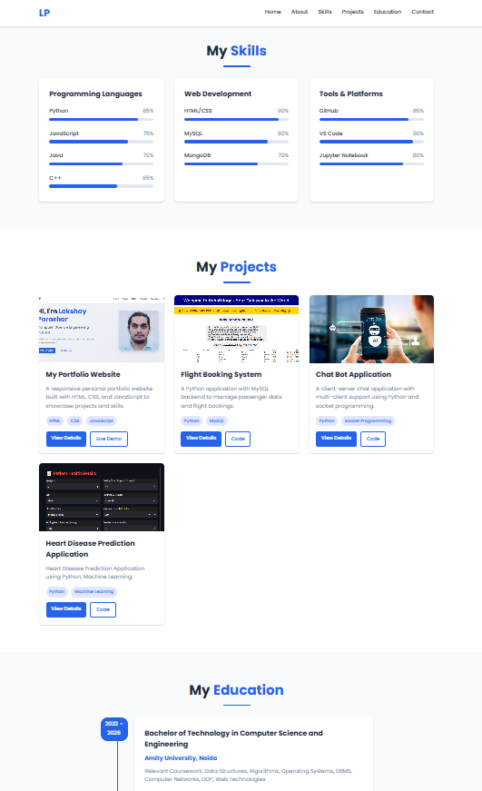

# 💼 Lakshay Parashar – Personal Portfolio Website

Welcome to the official repository of my personal portfolio website!  
This website is a showcase of who I am—my technical skills, major projects, experiences, and contact information—all designed with a modern and professional aesthetic.

## 🔗 Live Website

🌐 [Visit My Portfolio](https://lakshayparasharportfolio.netlify.app)

---

## 📌 Features

- ⚡ Sleek, modern UI with animations and transitions
- 🌙 Dark-themed design with blue-gradient accents
- 📱 Fully responsive (Mobile, Tablet & Desktop)
- 💻 Sections: About, Skills, Projects, Experience, Certifications, Resume, and Contact
- 🔗 Integrated social media links (LinkedIn, GitHub, etc.)
- 📄 Downloadable resume and working contact form

---

## 🛠️ Tech Stack

- **Frontend**: HTML5, CSS3, JavaScript  
- **Styling**: Custom CSS  
- **Animations**: CSS transitions, scroll effects  
- **Deployment**: GitHub Pages

---

## 📁 Folder Structure

portfolio/
├── assets/ # Images, resume, and icons
├── css/ # Stylesheets
├── js/ # JavaScript for interactivity
├── index.html # Main webpage
└── README.md # Project overview


---

## 🧠 What I Learned

- Designing clean, elegant, and professional UI/UX
- Writing modular and maintainable HTML/CSS/JS code
- Hosting and maintaining a personal website on GitHub Pages
- Presenting my profile as a developer in a creative and impactful way

---

## 📸 Preview



---

## 🚀 Run Locally

To view the project locally on your machine:

1. Clone the repository:
   ```bash
   git clone https://github.com/LakshayParashar/lakshayparashar28.github.io.git
   cd lakshayparashar28.github.io

## 🙋‍♂️ About Me

Lakshay Parashar
B.Tech CSE Student | Web Developer | AI/ML Enthusiast
📍 Amity University, Noida (Batch 2022–2026)

🔗 LinkedIn

🔗 GitHub

📧 lakshayparashar@gmail.com